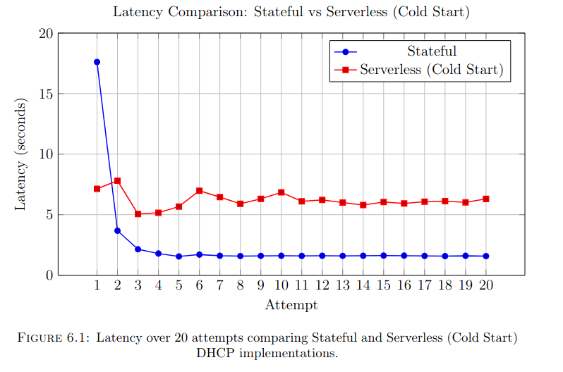

# Serverless Network Function (SNF): DHCP

Welcome to my MTP project showcasing a comparison between Stateful and Serverless implementations of DHCP.

## Architecture Diagram

## Results

More details can be found in [results.md](results.md).
